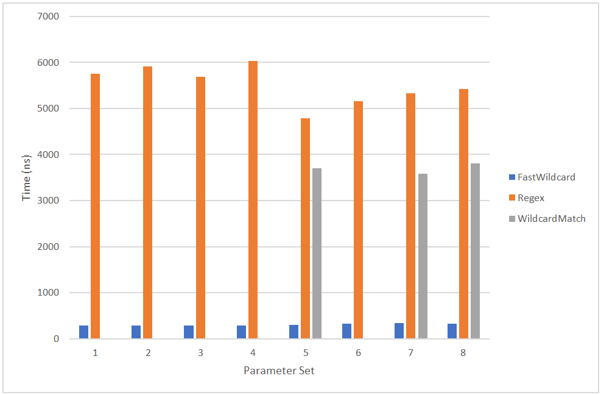

# FastWildcard

A wildcard matching library for .NET Core 2.x, and .NET Standard 1.3/2.0.

* _*Robust:*_ extensively unit tested to be reliable and predictable - no edge cases!
* _*Fast:*_ developed with regular benchmarking and performance analysis to provide the best speed possible!

## Pattern syntax

* '*' matches 0 or more characters
* '?' matches 1 character

For examples, please review some [`FastWildcard.Tests`](tests/FastWildcard.Tests/IsMatchTests.cs)!

## Benchmarks

Cross-library benchmark notes:

* Executed against FastWildcard 3.0.0 on an Azure Standard F2s virtual machine
* Compiled RegEx is excluded as under the full CLR its execution time is extremely high
* Values for WildcardMatch are an average as it encountered execution errors

Complete [test execution log](reports/FastWildcard.Performance.Benchmarks.LibraryComparison.log) and [reporting spreadsheet](reports/FastWildcard.Performance.Benchmarks.LibraryComparison-report.xlsx).
Or run [FastWildcard.Performance](tests/FastWildcard.Performance) yourself!

## Support details

Supports .NET Standard 1.3 and higher.
